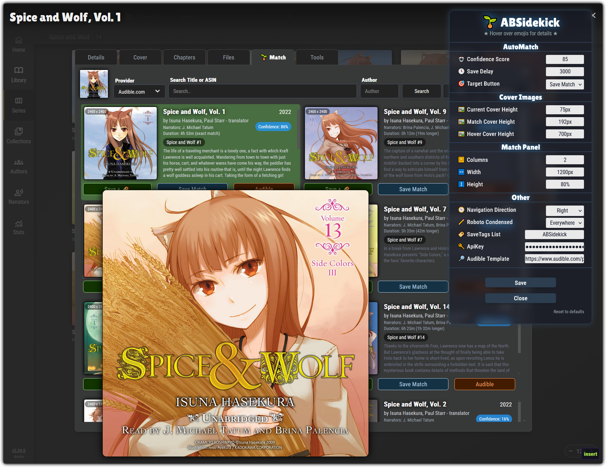

# 🌱 ABSidekick

  

 

This [UserScript](https://openuserjs.org/about/Userscript-Beginners-HOWTO) will add additional functionality directly into the [AudioBookshelf](https://www.audiobookshelf.org/) web interface. There are customizable settings that can be configured through the **ABSidekick Settings Panel**, which can be accessed by clicking the  `🛠️` emoji in the Audiobookshelf AppBar.

## Match Tab
A suite of additional features to dramatically speed up your matching and allow for a more automated approach

* `Save Match` button: Save the selected match result (like clicking the `Submit` button) and then cycle to the next book in the list
* `Save + Tag` button: Save the selected match result (like clicking the `Submit` button), add custom tag(s), and then cycle to the next book in the list
* `Audible` button: Using the *ASIN* of the match result, open a new tab to its *Audible* page
* `Title` button: Quickly fill the search field with the current title of the book, useful when the auto-populated *ASIN* search returns *No Results*
* `AutoMatch` button: Automatically select and save the first match that has a minimum confidence percentile, which can be specified in the settings panel
* **Grid View**: The match results will be displayed in a grid view, allowing you to see more of them at once
* **Current Cover**: The current cover of the book will be displayed above the match results, which serves as a visual reference to help you in quickly selecting the correct match result
* **Hover Covers**: Hover your mouse over cover images to quickly enlarge them for detailed viewing
* Auto `Title` fill: If the initial *ASIN* search returns *No Results*, the title will be automatically populated into the search field, the same as when clicking the `Title` button.

## Install
ABSidekick is a **UserScript** that is installed through a **UserScript Manager** addon in your browser. A **UserScript Manager** is just like any other browser addon, which means you can find and install one from wherever you get your browser addons.

If you are not sure which manager to get, the one I use and recommend above all others is [ViolentMonkey](https://violentmonkey.github.io/), for its loyal development team and open-source nature. If that's not available to you, my next recommendation would be [Tampermonkey](https://www.tampermonkey.net/).

Once you have added a **UserScript Manager** to your browser, simply click the **Install** link below and the manager will prompt you to install **ABSidekick**. After that, simply go to your Audiobookshelf interface and you'll see the changes made by **ABSidekick**. You may have to refresh at first, since Audiobookshelf has some weird behaviours when you first go to the  page.

ℹ️ If **ABSidekick** does not automatically run when you are on Audiobookshelf, you will need to edit the `@match` line near the top of the script so that it points to your actual Audiobookshelf URL. Be aware that **ABSidekick** is configured to recieve auto-updates, so any edits you make will be overwritten by future updates

⚠️ UserScripts like **ABSidekick** will run **code** in your browser when you visit certain pages. It is important to be aware of this and therefore only install UserScripts from trusted sources.

>
> **Source: [GitHub](https://github.com/WirlyWirly/ABSidekick)** 
> **Install: [🌱 ABSidekick](https://raw.githubusercontent.com/WirlyWirly/ABSidekick/main/ABSidekick.user.js?raw=true)** 
> Written on [🐺 LibreWolf](https://librewolf.net/) via [🐵 Violentmonkey](https://violentmonkey.github.io/)
