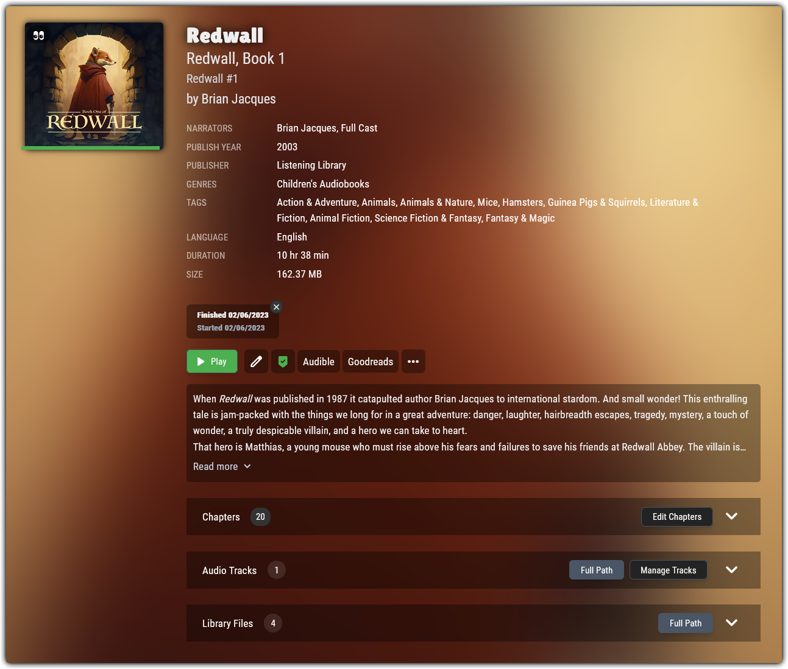

# 🌱 ABSidekick

This [UserScript](https://openuserjs.org/about/Userscript-Beginners-HOWTO) will add new features directly into the [AudioBookshelf](https://www.audiobookshelf.org/) web interface.

Adding features through a **UserScript** allows *anyone* to have have simple and immediate access to these new features, without having to perform *any* server-side changes or wait for them to be implemented by the Audiobookshelf team.

The **ABSidekick Settings Panel** can be accessed by clicking the  `🛠️` emoji in the Audiobookshelf app bar.

## Match Tab

<div align="center">
  
</div><br>

A suite of new features to dramatically speed up your matching by allowing for a more automated approach

* `🤖 AutoMatch` button: Automatically select and save the first match that has *at-least* a specific confidence score, then cycle to the next book in the list and do it again! This allows you to automate the repetative matching process, while at the same time giving you a chance to stop it if the selected match doesn't look right.
* `🏷️ No Match` button: Quickly add custom tag(s) to the book and then cycle to the next book in the list, which is a useful way to easily distinguish books that do not have a proper match
* `Title` button: Quickly perfrom a search using the title of the book, useful for when the initial *ASIN* search returns *No Results*
* `Save Match` button: Save the selected match result (like clicking the `Submit` button) and then cycle to the next book in the list
* `Save + 🏷️` button: Save the selected match result (like clicking the `Submit` button), add custom tag(s), and then cycle to the next book in the list
* `Audible` button: Using the *ASIN* of the match result, open a new tab to its *Audible* page
* **Current Cover**: The current cover of the book will be displayed above the match results, which serves as a visual reference to help you in quickly selecting the correct match result
* **Grid View**: Display the match results in a grid view, which allows you to see more of them at once and makes better use of screen space.
* **Hover Covers**: Hover your mouse over cover images to quickly enlarge them for detailed viewing
* **Auto `Title` search**: If the initial *ASIN* search returns *No Results*, the title of the book will be searched for automatically, the same behaviour as clicking the `Title` button.

## Item Pages

<div align="center">
  
</div><br>

A suite of customizations that add a little color and some new features to an item page

* `Audible` button: Using the *ASIN* of the item, open its *Audible* page in a new tab
* `Goodreads` button: Using the *Title* of the item, perform a *Goodreads* search in a new tab
* `Custom` buttons: Define custom url templates that will be used to generate and display quick-search buttons
* **Background Blur**: Add some color to the page by applying a colorful blur effect based on the cover image
* **Black Glass**: Give the various floating items a black glass effect
* **Hover Cover**: Hover your mouse over the cover image to quickly enlarge it for detailed viewing

## ABSidekickRenamer
Audiobookshelf does **not** have the ability to directly rename\organize folders, so if you would like to organize your actual folders with the newly matched metadata, it must be done server-side using other means.

Therefore, included in this repo is the file `ABSidekickRenamer.py`, which is a small python script that will allow you to quickly rename\organize your items based on the contents of their `metadata.json` file.

> ℹ️ In your Audiobookshelf settings, make sure to enable the option `Store metadata with item`

For the full usage of `ABSidekickRenamer.py`, pass the `--help` flag, but here are some examples...

> **Basic**
> 
> The `-d` flag performs a `dry-run`, which will allow you to view the results without actually making any changes.
>```bash
>$ python './ABSidekickRenamer.py' -d --output '/path/to/output/folder' '/path/to/audiobookshelf/library/folder'
>```


> **Recommended**
> 
> This will rename **only** the books that have the tag `tagName` and the output folders will have a customized format.
>```bash
>$ python './ABSidekickRenamer.py' --tag 'tagName' --format '%author%/%title% [ASIN-%asin%]/' --output '/path/to/output/folder' '/path/to/audiobookshelf/library/folder'
>```

## Install
ABSidekick is a **UserScript**, so will require that you have a **UserScript Manager** addon for your browser

<details>
<summary> ❔ Click here if you are new to UserScripts</summary>

A **UserScript** is a file of **JavaScript** code that is executed by a *UserScript Manager*, which is a browser addon who's purpose is to run a *UserScript* when you visit a site it is programmed to operate on. You can can find and install a *UserScript Manager* addon from your browsers web store...

> **Violentmonkey**:
[Firefox](https://addons.mozilla.org/en-US/firefox/addon/violentmonkey/) | 
[Chrome](https://chromewebstore.google.com/detail/violentmonkey/jinjaccalgkegednnccohejagnlnfdag) | 
[Edge](https://microsoftedge.microsoft.com/addons/detail/violentmonkey/eeagobfjdenkkddmbclomhiblgggliao)<br>
> **Tampermonkey**:
[Firefox](https://addons.mozilla.org/en-US/firefox/addon/tampermonkey/) | 
[Chrome](https://chromewebstore.google.com/detail/tampermonkey/dhdgffkkebhmkfjojejmpbldmpobfkfo) |
[Edge](https://microsoftedge.microsoft.com/addons/detail/tampermonkey/iikmkjmpaadaobahmlepeloendndfphd) |
[Safari](https://apps.apple.com/us/app/tampermonkey/id6738342400)

If you are not sure which *UserScript Manager* to install, the one I would recommend above all others is [Violentmonkey](https://violentmonkey.github.io/), both for its fantastice development team and open-source nature. If Violentmonkey is not available to you, my next recommendation would be [Tampermonkey](https://www.tampermonkey.net/), which is more widely available but is not open-source.

Once you have installed a *UserScript Manager* addon to your browser, simply click the **Install** link below and the manager will prompt you to install *ABSidekick*. After it has been installed, you will immediately start seeing the changes made by *ABSidekick* whenever you visit the Audiobookshelf web interface! 🥳 

⚠️ UserScripts like **ABSidekick** will run **code** in your browser when you visit certain pages. It is important to be aware of this and therefore only install UserScripts from trusted sources.

***

</details>

ℹ️ For full **ABSidekick** functionality, you must provide a **ApiKey**, which can be generated in the Audiobookshelf settings.

ℹ️ When you first open the Audiobookshelf web interface, abs will add the `/audiobookshelf/` part to your **URL** if you did not include it. *ABSidekick* will **not** run automatically unless the URL **already** contains the  `/audiobookshelf/` part without abs needing to add it. To fix this, you can either refresh the page after abs has changed the URL, or simply add the `/audiobookshelf/` part to your bookmark, that way whenever you open the bookmark, abs doesn't need to add it for you because you are already opening the full URL.

ℹ️ If **ABSidekick** does not run automatically for you, then you will need to edit the `@match` line near the top of the script so that it points to your actual `IP:PORT`. Be aware that **ABSidekick** is configured to recieve auto-updates, so any edits you make to the script directly will be overwritten by future updates

>
> **Source: [GitHub](https://github.com/WirlyWirly/ABSidekick)**<br>
> **Install: [🌱 ABSidekick](https://raw.githubusercontent.com/WirlyWirly/ABSidekick/main/ABSidekick.user.js?raw=true)**<br>
> Written on [🐺 LibreWolf](https://librewolf.net/) via [🐵 Violentmonkey](https://violentmonkey.github.io/)

